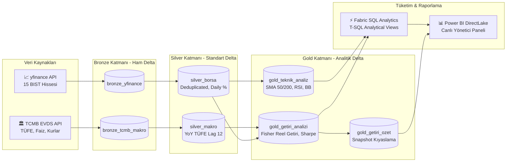
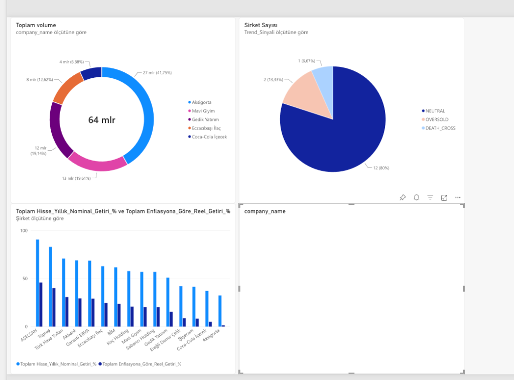
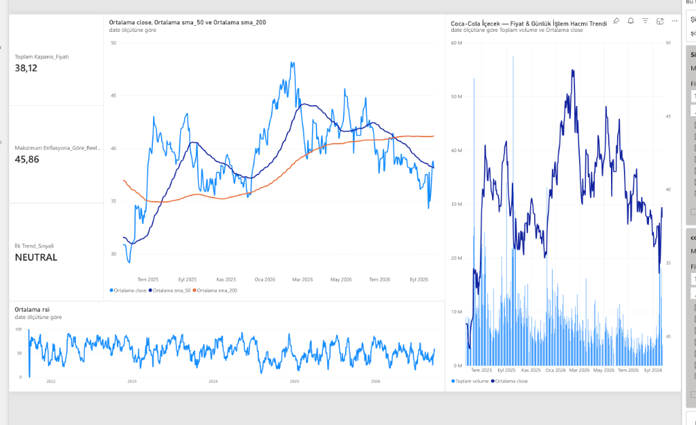

# 🏦 Kurumsal Bankacılık & Finansal Piyasa Veri Platformu (Microsoft Fabric & Power BI)

[](https://fabric.microsoft.com/)
[](https://delta.io/)
[](https://spark.apache.org/)
[](https://powerbi.microsoft.com/)
[](https://evds2.tcmb.gov.tr/)

---

## 📌 Proje Özeti & İş Problemi (Executive Summary)

Yüksek enflasyon ve dinamik para politikası ortamlarında, hisse senetlerinin **nominal getirileri** yatırımcıları ve şirket yönetimlerini yanıltabilmektedir. Yıllık %60 kazandıran bir şirket, enflasyonun %65 olduğu bir ortamda gerçekte sermaye eritmektedir.

Bu kurumsal platform; **Borsa İstanbul (BIST)** ve **Türkiye Cumhuriyet Merkez Bankası (TCMB EVDS)** verilerini otomatik olarak toplayan, **Medallion mimarisi (Bronze $\rightarrow$ Silver $\rightarrow$ Gold)** ile işleyen ve **Fisher Denklemi** ile hisselerin gerçek satın alma gücü getirilerini (**Reel Getiri**) hesaplayan uçtan uca modern bir veri mühendisliği platformudur.

Platform özellikle danışmanlık ve portföy şirketinin çalıştığı **5 kilit müşteri şirketinin** (*Coca-Cola İçecek, Mavi Giyim, Aksigorta, Gedik Yatırım, Eczacıbaşı İlaç*) yanı sıra BIST lokomotifi toplam **15 şirketin** teknik ve makro risk profilini gerçek zamanlı takip eder.

---

## 🏗️ Uçtan Uca Platform Mimarisi

Sistem, tamamen bulut yerel (cloud-native) **Microsoft Fabric** üzerinde inşa edilmiştir:



---

## ⚙️ Microsoft Fabric Data Factory Orkestrasyonu

Platform, her işlem günü seans kapanışından sonra (TSİ **18:30**) otomatik olarak tetiklenir. Pipeline mimarisi; **Paralel Çatallanma (Fork-Join)**, **Hata Yönetimi (Circuit Breaker)**, **Otomatik Model Yenileme (DirectLake)** ve **Delta Bakımı (Z-ORDER)** adımlarını içerir:


### 🔄 İşlem Hattı Akış Adımları:
1. **Durum Başlatma (`Set variable1`):** Pipeline çalışma zaman damgası ve telemetrisi hafızaya alınır.
2. **Paralel Bronze Ingestion (Fork-Join):** 
   * `api_1a` (BIST 15 hissesi) ve `api_1b` (TCMB makro serileri) bağımsız ve eş zamanlı çekilir.
3. **Merkezi Silver Standardizasyonu (`bronztosilver`):**
   * Tip dönüşümleri, mükerrer kayıt temizliği (deduplication) ve türetilmiş metrikler hesaplanır.
4. **Hata Yakalama & Devre Kesici (Circuit Breaker):**
   * Silver adımında bir hata oluşursa akış durdurulur ve kırmızı okla bağlı `Office365Email2` mühendis ekibine anında hata bildirimi gönderir.
5. **Paralel Gold Analitiği:**
   * `gold_3a` (Teknik Analiz & Sinyaller) ve `gold_3b` (Fisher Reel Getiri & Sharpe) paralel hesaplanır.
6. **Doğrudan Model Yenileme (`Anlamsal modeli yenileme`):**
   * Power BI Semantic Modeli, insan müdahalesi olmadan DirectLake ile anında güncellenir.
7. **Otomatik Delta Lake Bakımı (`NB_04_Maintenance_Optimize`):**
   * Günlük artımlı yüklemelerin oluşturduğu küçük dosyalar `OPTIMIZE` ve `Z-ORDER` ile sıkıştırılır (Compaction).
8. **Başarı Bildirimi (`Office365Email1`):**
   * Tüm süreç başarıyla tamamlandığında yöneticiye onay e-postası iletilir.

---

## 📊 Power BI Yönetici Kokpiti (DirectLake)

Raporlama katmanı, **DirectLake** teknolojisi sayesinde veriyi içe aktarmadan (Import) doğrudan OneLake üzerindeki Delta tablolarından sorgular.

### 1. Müşteri Şirketleri Karşılaştırma Sayfası
Danışmanlık müşterisi olan 5 şirketin likidite payı, enflasyon üstü reel kârı, teknik trend sağlığı ve risk profili tek bir ekranda özetlenir:
* **Halka Grafiği (Donut Chart):** Şirketlerin piyasadaki günlük işlem hacmi ve likidite payı dağılımı.
* **Kümelenmiş Sütun Grafik:** 1 Yıllık Nominal Getiri vs. Enflasyondan Arındırılmış Net Reel Kazanç.
* **Pasta Grafiği (Pie Chart):** Portföyün teknik sinyal sağlığı (Yükseliş, Nötr, Aşırı Satım).
* **Yatay Çubuk Grafik:** Şirketlerin yıllık dalgalanma ve risk (volatilite) seviyeleri.



### 2. Şirket Derinlemesine Röntgen Sayfası (Örn: Mavi Giyim)
Her müşteri şirketi için özel olarak hazırlanmış dinamik analiz sayfası:
* **Güncel KPI Kartları:** Son İşlem Kapanış Fiyatı, Fisher Reel Getirisi, Trend Durumu.
* **Fiyat & 50/200 Günlük Hareketli Ortalamalar (SMA):** Golden Cross / Death Cross kesişimleri.
* **Fiyat ve İşlem Hacmi Birleşik Grafiği:** Fiyat hareketlerine eşlik eden piyasa likiditesi.
* **RSI Momentum Osilatörü:** 14 günlük aşırı alım / satım bantları.



---

## 🧮 Finansal Mühendislik & Metrik Hesaplamaları

| Metrik | Formül / Yöntem | Finansal Anlamı |
|---|---|---|
| **Fisher Reel Getiri** | $r_{\text{reel}} = \frac{1 + r_{\text{nominal}}}{1 + i_{\text{TÜFE}}} - 1$ | Enflasyondan arındırılmış gerçek satın alma gücü artışı. |
| **Trailing 1-Year Return** | $\frac{\text{Close}_t - \text{Close}_{t-252}}{\text{Close}_{t-252}} \times 100$ | Gerçek 252 işlem gününü baz alan yıllıklandırılmış performans. |
| **Yıllıklandırılmış Volatilite** | $\sigma_{\text{günlük}} \times \sqrt{252} \times 100$ | Hissenin 1 yıllık standart sapma risk ölçüsü. |
| **Sharpe Rasyosu** | $\frac{r_{\text{yıllık}} - R_f}{\sigma_{\text{yıllık}}}$ ($R_f$: TCMB %40 Politika Faizi) | Üstlenilen birim risk başına elde edilen faiz üstü kâr. |
| **TÜFE Yıllık Enflasyon** | $\text{Lag}(CPI, 12)$ bazlı gerçek YoY değişim | TCMB TÜFE endeks serisinin resmi yıllık artış oranı. |
| **Faiz Duyarlılık Betası** | $\frac{\text{Cov}(R_i, \Delta \text{Faiz})}{\text{Var}(\Delta \text{Faiz})}$ | TCMB faiz kararlarının banka ve şirket hisselerine etkisi. |

---

## 📁 Depo Dizin Yapısı (Repository Structure)

```text
├── config/
│   └── settings.py                 # 15 hisse senedi ve TCMB EVDS serileri yapılandırması
├── docs/
│   ├── architecture.md             # Detaylı sistem mimari dokümanı
│   └── images/                     # Pipeline ve Power BI ekran görüntüleri
├── notebooks/                      # Microsoft Fabric PySpark kodları
│   ├── 00_market_calendar_check.py # FinOps borsa tatil ve takvim denetimi
│   ├── 01a_ingest_yfinance.py      # BIST 15 hissesi artımlı veri çekimi (MERGE INTO)
│   ├── 01b_ingest_tcmb.py          # TCMB EVDS faiz, kur, enflasyon serileri çekimi
│   ├── 02_bronze_to_silver.py      # Tip dönüşümü, temizleme, deduplication ve unpivot
│   ├── 03a_gold_teknik_analiz.py   # SMA(50/200), RSI(14), Bollinger Bantları, Sinyaller
│   ├── 03b_gold_makro_getiri.py    # Fisher reel getirisi, Sharpe oranı, makro dashboard
│   └── 04_maintenance_optimize.py  # Delta Lake Z-ORDER Compaction ve bakım adımı
├── sql/
│   ├── analytical_views.sql        # Fabric SQL Endpoint analitik görünümleri (5 T-SQL View)
│   └── ad_hoc_analysis.sql         # Test ve doğrulama SQL sorguları
├── .gitignore                      # Sistem, Python ve önbellek filtreleri
└── README.md                       # Proje dokümantasyonu
```

---

## 🚀 Kurulum ve Dağıtım Rehberi (Deployment Guide)

### 1. Ön Koşullar:
* Aktif bir **Microsoft Fabric** çalışma alanı (Workspace).
* TCMB EVDS API Anahtarı ([EVDS Kayıt](https://evds2.tcmb.gov.tr/)).

### 2. Adım Adım Kurulum:
1. **Lakehouse Oluşturma:** Fabric Workspace içerisinde `lh_bankacilik_finans` adında bir Lakehouse açın.
2. **Notebook'ları Yükleme:** `notebooks/` klasöründeki dosyaları Fabric içerisine Notebook olarak aktarın ve Lakehouse'unuza bağlayın.
3. **Data Factory Pipeline:** `pipeline_bist_makro_canli` adında bir pipeline açıp yukarıdaki mimari şemaya göre kutuları ve yeşil/kırmızı okları bağlayın.
4. **Zamanlayıcı (Schedule):** Pipeline'ı hafta içi her gün saat **18:30 (TSİ)** olarak zamanlayın.
5. **SQL Görünümleri:** Lakehouse'un **SQL analytics endpoint** penceresini açıp [`sql/analytical_views.sql`](sql/analytical_views.sql) dosyasını çalıştırın.
6. **Power BI DirectLake:** Fabric üzerinden doğrudan DirectLake modunda yeni rapor oluşturarak şablon görselleri bağlayın.

---

## 🛡️ FinOps & Kurumsal Veri Kalite Standartları

* **Artımlı Yükleme (Incremental MERGE INTO):** Geçmiş 5 yıllık veri her gün tekrar indirilmez; sadece yeni işlem gününün verisi `MERGE INTO` ile eklenir. Bu sayede pipeline süresi 15 dakikadan **1-2 dakikaya** iner.
* **FinOps Hafta Sonu Koruması:** Hafta sonları ve resmi tatillerde borsa kapalıyken sunucu kaynakları (Compute Units) çalıştırılmaz; bulut maliyeti optimize edilir.
* **Self-Healing Delta Bakımı:** `OPTIMIZE ... ZORDER BY (ticker, date)` komutuyla DirectLake sorgu hızları sürekli maksimumda tutulur.

---

**Geliştirici:** Efe Hakan Yıldız  
**Platform:** Microsoft Fabric | Apache Spark | Delta Lake | Power BI DirectLake
