# 🏦 Kurumsal Bankacılık & Finansal Piyasa Veri Platformu (Microsoft Fabric & Power BI)

[](https://fabric.microsoft.com/)
[](https://delta.io/)
[](https://spark.apache.org/)
[](https://powerbi.microsoft.com/)
[](https://evds2.tcmb.gov.tr/)

---

## 📌 Proje Özeti & İş Problemi (Executive Summary)

Yüksek enflasyon ve dinamik para politikası ortamlarında, hisse senetlerinin **nominal getirileri** yatırımcıları ve şirket yönetimlerini yanıltabilmektedir. Yıllık %60 kazandıran bir şirket, enflasyonun %65 olduğu bir ortamda gerçekte sermaye eritmektedir.

Bu kurumsal platform; **Borsa İstanbul (BIST)** ve **Türkiye Cumhuriyet Merkez Bankası (TCMB EVDS)** verilerini otomatik olarak toplayan, **Medallion mimarisi (Bronze $\rightarrow$ Silver $\rightarrow$ Gold)** ile işleyen ve **Fisher Denklemi** ile hisselerin gerçek satın alma gücü getirilerini (**Reel Getiri**) hesaplayan uçtan uca modern bir veri mühendisliği platformudur.

Platform özellikle danışmanlık ve portföy şirketinin çalıştığı **5 kilit müşteri şirketinin** (*Coca-Cola İçecek, Mavi Giyim, Aksigorta, Gedik Yatırım, Eczacıbaşı İlaç*) yanı sıra BIST lokomotifi toplam **15 şirketin** teknik ve makro risk profilini gerçek zamanlı takip eder.

---

## 🏗️ Uçtan Uca Platform Mimarisi

Sistem, tamamen bulut yerel (cloud-native) **Microsoft Fabric** üzerinde inşa edilmiştir:

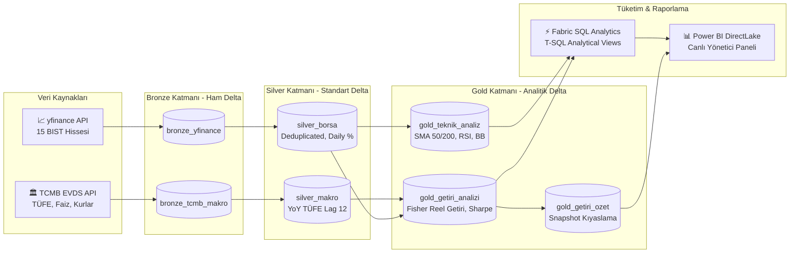

---

## ⚙️ Microsoft Fabric Data Factory Orkestrasyonu

Platform, her işlem günü seans kapanışından sonra (TSİ **18:30**) otomatik olarak tetiklenir. Pipeline mimarisi; **Paralel Çatallanma (Fork-Join)**, **Hata Yönetimi (Circuit Breaker)**, **Otomatik Model Yenileme (DirectLake)** ve **Delta Bakımı (Z-ORDER)** adımlarını içerir:

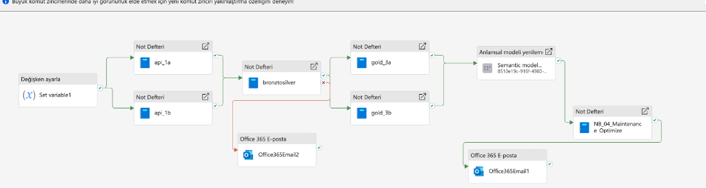

### 🔄 İşlem Hattı Akış Adımları:
1. **Durum Başlatma (`Set variable1`):** Pipeline çalışma zaman damgası ve telemetrisi hafızaya alınır.
2. **Paralel Bronze Ingestion (Fork-Join):** 
   * `api_1a` (BIST 15 hissesi) ve `api_1b` (TCMB makro serileri) bağımsız ve eş zamanlı çekilir.
3. **Merkezi Silver Standardizasyonu (`bronztosilver`):**
   * Tip dönüşümleri, mükerrer kayıt temizliği (deduplication) ve türetilmiş metrikler hesaplanır.
4. **Hata Yakalama & Devre Kesici (Circuit Breaker):**
   * Silver adımında bir hata oluşursa akış durdurulur ve kırmızı okla bağlı `Office365Email2` mühendis ekibine anında hata bildirimi gönderir.
5. **Paralel Gold Analitiği:**
   * `gold_3a` (Teknik Analiz & Sinyaller) ve `gold_3b` (Fisher Reel Getiri & Sharpe) paralel hesaplanır.
6. **Doğrudan Model Yenileme (`Anlamsal modeli yenileme`):**
   * Power BI Semantic Modeli, insan müdahalesi olmadan DirectLake ile anında güncellenir.
7. **Otomatik Delta Lake Bakımı (`NB_04_Maintenance_Optimize`):**
   * Günlük artımlı yüklemelerin oluşturduğu küçük dosyalar `OPTIMIZE` ve `Z-ORDER` ile sıkıştırılır (Compaction).
8. **Başarı Bildirimi (`Office365Email1`):**
   * Tüm süreç başarıyla tamamlandığında yöneticiye onay e-postası iletilir.

---

## 📊 Power BI Yönetici & Analitik Raporlama Paketi (DirectLake)

Tüm raporlar OneLake üzerindeki Gold Delta tablolarına **DirectLake** moduyla bağlıdır. Veri modeli belleğe kopyalanmaz, sıfır gecikmeyle canlı çalışır. Paneller mantıksal bir yatırım bankacılığı akışıyla (Makro $\rightarrow$ Portföy $\rightarrow$ Şirket Röntgeni) 3 ana bölüme ayrılmıştır:

---

### Bölüm I: Makro Piyasa, Risk & Sektörel Görünüm (Top-Down Analiz)

#### 1. BIST Reel Getiri & Sektörel Piyasa Isı Haritası (Finviz / Bloomberg Stili)
Tüm 15 şirketin Fisher denklemi bazlı reel getiri karnesi, güncel teknik sinyalleri ve sağ altta sektör ağırlıklarına göre kümelenmiş devasa BIST Piyasa Isı Haritası (Treemap):
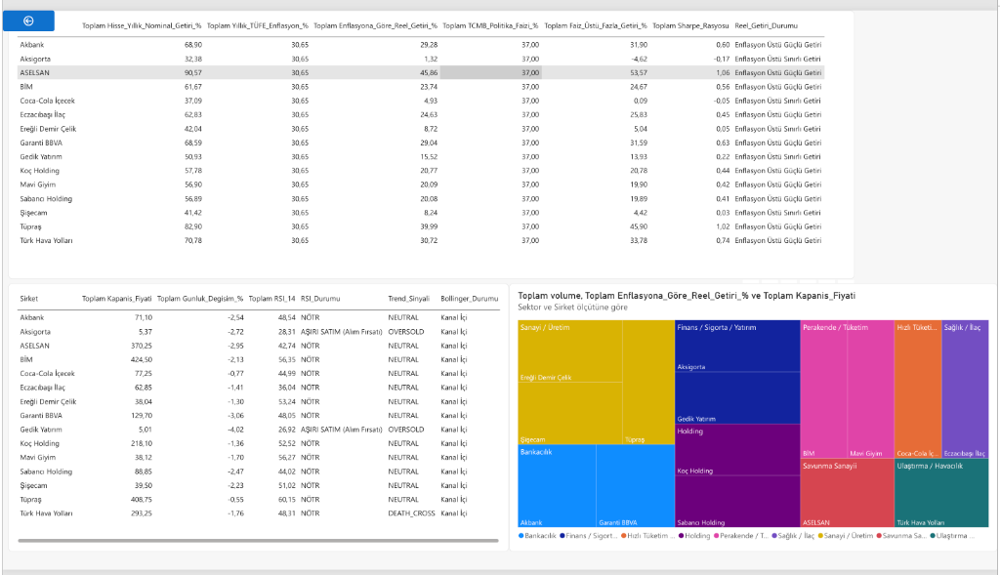

#### 2. Bankacılık Faiz Riski (IRRBB), Likidite & Makro Trendler
TCMB Politika Faizi ve döviz kurları (USD/TRY, EUR/TRY) yükselirken şirketlerin faiz duyarlılık betaları, likidite profilleri ve Risk vs. Getiri Dağılım Baloncuk Grafiği (Scatter Plot):
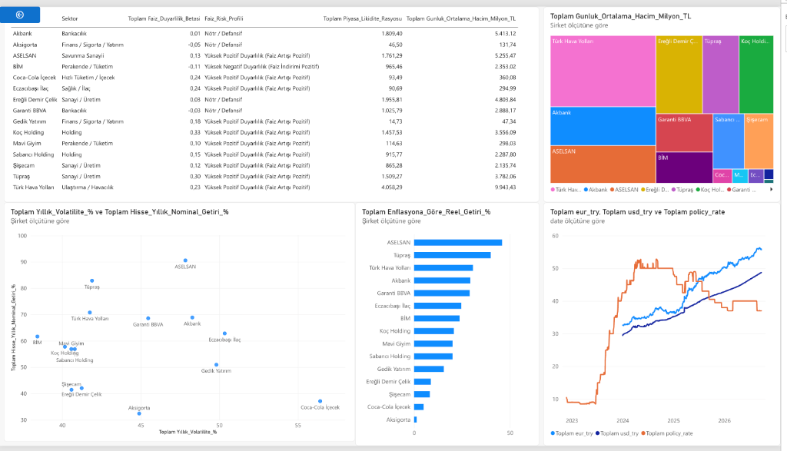

#### 3. 15 Hissenin Kümülatif Getiri Şampiyonları (2022 – 2026 Trendi)
Son 5 yıllık dönemde hisselerin kümülatif getiri ayrışması ve sağdaki dinamik şirket seçici (Slicer):
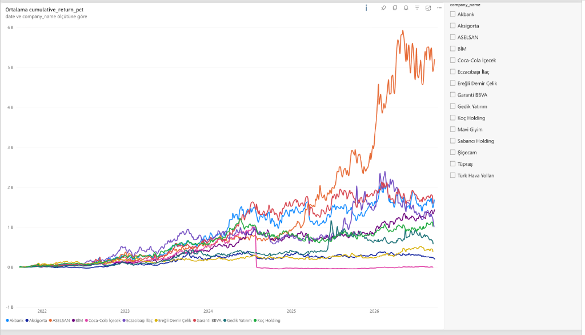

---

### Bölüm II: Danışmanlık Portföyü — Müşteri Şirketleri Kıyaslama Kokpiti

#### 4. Kilit 5 Müşteri Şirketi — 6'lı Karşılaştırmalı Performans Kokpiti
Firmanın çalıştığı 5 özel şirketin (*Coca-Cola İçecek, Mavi Giyim, Eczacıbaşı İlaç, Aksigorta, Gedik Yatırım*) likidite payı (Halka), enflasyona göre net kârı (Sütun), faiz üstü ekstra getirisi (Çubuk), piyasa trendi (Pasta), volatilite riski (Çubuk) ve RSI güç sıralaması (Huni):
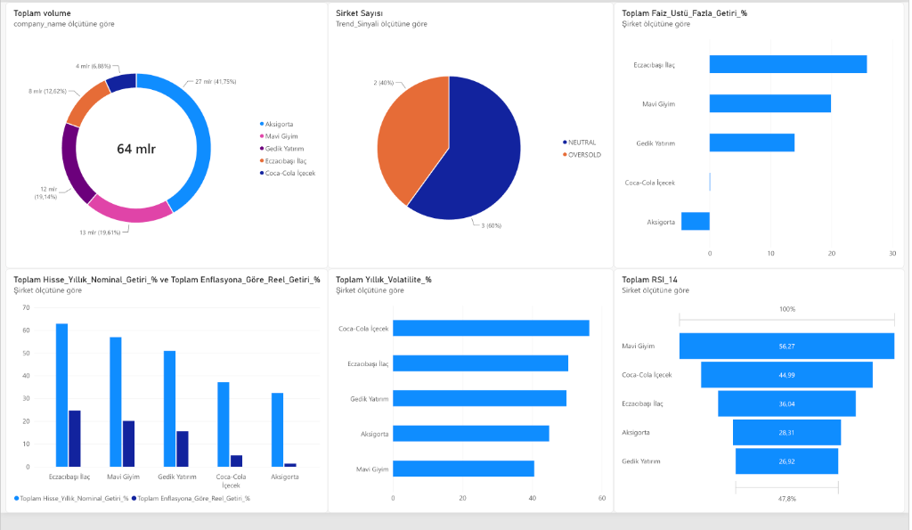

---

### Bölüm III: Müşteri Şirketleri Derinlemesine Röntgen (Company Deep-Dives)

Her bir müşteri şirketi için özel olarak hazırlanmış; güncel kapanış fiyatı, Fisher reel getirisi, trend durumu, 50/200 günlük hareketli ortalamalar (SMA), fiyat & işlem hacmi trendi ve 14 günlük RSI osilatörünü içeren derinlemesine analiz sayfaları:

#### 5. Coca-Cola İçecek (`CCOLA.IS` | Hızlı Tüketim & İçecek)
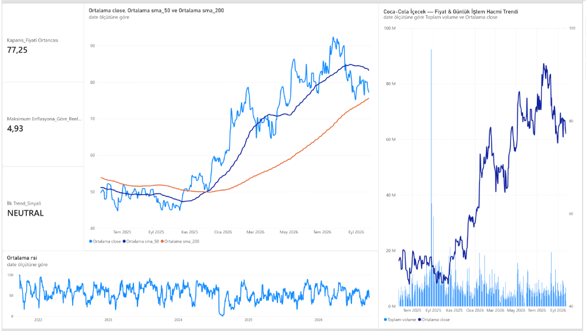

#### 6. Mavi Giyim (`MAVI.IS` | Perakende & Tekstil)
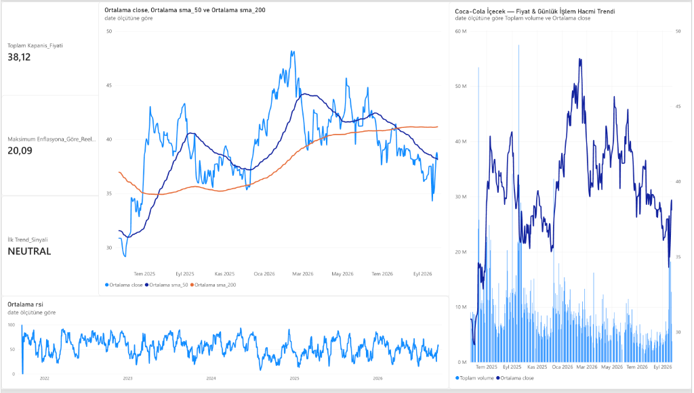

#### 7. Eczacıbaşı İlaç (`ECILC.IS` | Sağlık & İlaç)
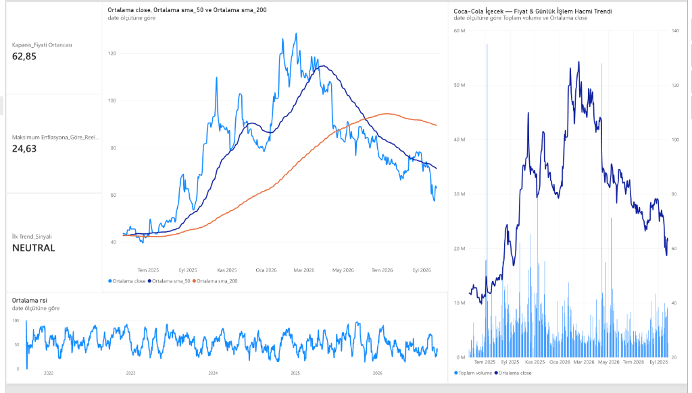

#### 8. Aksigorta (`AKGRT.IS` | Finans & Sigortacılık)
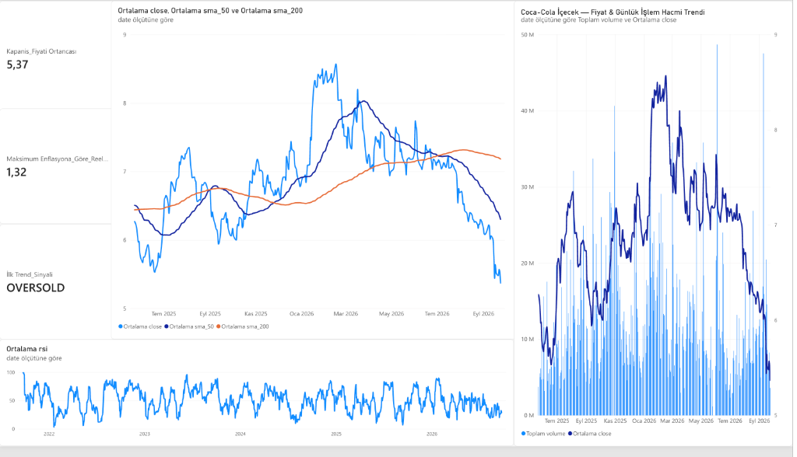

#### 9. Gedik Yatırım (`GEDIK.IS` | Finansal Hizmetler & Aracı Kurum)
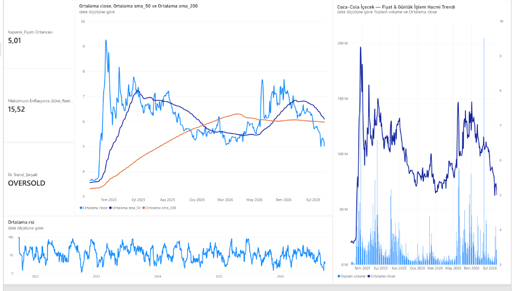

---

## 🧮 Finansal Mühendislik & Metrik Hesaplamaları

| Metrik | Formül / Yöntem | Finansal Anlamı |
|---|---|---|
| **Fisher Reel Getiri** | $r_{\text{reel}} = \frac{1 + r_{\text{nominal}}}{1 + i_{\text{TÜFE}}} - 1$ | Enflasyondan arındırılmış gerçek satın alma gücü artışı. |
| **Trailing 1-Year Return** | $\frac{\text{Close}_t - \text{Close}_{t-252}}{\text{Close}_{t-252}} \times 100$ | Gerçek 252 işlem gününü baz alan yıllıklandırılmış performans. |
| **Yıllıklandırılmış Volatilite** | $\sigma_{\text{günlük}} \times \sqrt{252} \times 100$ | Hissenin 1 yıllık standart sapma risk ölçüsü. |
| **Sharpe Rasyosu** | $\frac{r_{\text{yıllık}} - R_f}{\sigma_{\text{yıllık}}}$ ($R_f$: TCMB %40 Politika Faizi) | Üstlenilen birim risk başına elde edilen faiz üstü kâr. |
| **TÜFE Yıllık Enflasyon** | $\text{Lag}(CPI, 12)$ bazlı gerçek YoY değişim | TCMB TÜFE endeks serisinin resmi yıllık artış oranı. |
| **Faiz Duyarlılık Betası** | $\frac{\text{Cov}(R_i, \Delta \text{Faiz})}{\text{Var}(\Delta \text{Faiz})}$ | TCMB faiz kararlarının banka ve şirket hisselerine etkisi. |

---

## 💻 Fabric SQL Analytics — 10 Temel İş Analitiği Sorgusu

Power BI raporlamasından bağımsız olarak, veri analistleri ve portföy yöneticilerinin Fabric **SQL Analytics Endpoint** üzerinde doğrudan çalıştırabileceği 10 temel iş sorgusu [`sql/sql_analysis.sql`](sql/sql_analysis.sql) dosyasında hazırlanmıştır:

1. **Enflasyonu Yenen Şampiyon Şirketler:** 15 şirket arasında enflasyonu en çok aşan ilk 5 şirket hangisi.
2. **5 Özel Müşteri Şirketimizin Güncel Durum Karnesi:** Danışmanlık müşterisi olan 5 şirketin son fiyat ve teknik sinyalleri nedir.
3. **Kelepir ve Potansiyel Alım Fırsatı Veren Hisseler:** RSI göstergesi 35 altında olan aşırı satılmış hisseler hangileri.
4. **Şirketlerin Risk Kademelerine Göre Dağılımı:** Hisselerden hangileri defansif sakin, hangileri agresif oynak.
5. **Sektör Bazında Ortalama Getiri ve Hacim Liderliği:** BIST'te hangi sektörler daha karlı ve piyasa likiditesinin ne kadarına sahip.
6. **TCMB Politika Faizi vs Enflasyon Makası:** Merkez Bankası faizi ile yıllık enflasyon arasındaki reel fark son aylarda ne oldu.
7. **Risksiz Faiz Üstü Ekstra Kazanç Sağlayanlar:** TCMB politika faizini geçip yatırımcısına ekstra prim kazandıran şirketler kimler.
8. **Piyasa Likidite Şampiyonları:** Günlük işlem hacmi en yüksek ilk 5 hisse senedi hangisi.
9. **Çift Hareketli Ortalamanın Üzerindeki Güçlü Boğa Hisseleri:** Hem 50 günlük hem 200 günlük ortalamasının üstündeki hisseler hangileri.
10. **Dolar Kuru Artışını Aşan Şirketler (Döviz Bazında Koruma):** 1 yılda Dolar kuru yaklaşık %35 arttı; dolardan daha çok kazandıran şirketler hangileri.

---

## 📁 Depo Dizin Yapısı (Repository Structure)

```text
├── config/
│   └── settings.py                 # 15 hisse senedi ve TCMB EVDS serileri yapılandırması
├── docs/
│   ├── architecture.md             # Detaylı sistem mimari dokümanı
│   └── images/                     # Pipeline ve sıralı Power BI ekran görüntüleri
│       ├── fabric_data_factory_pipeline.png
│       ├── 01_makro_piyasa_ve_sektorel_isi_haritasi.png
│       ├── 02_bankacilik_risk_faiz_duyarliligi_ve_makro_trend.png
│       ├── 03_kumulatif_getiri_performans_trendi.png
│       ├── 04_musteri_sirketleri_karsilastirma_kokpiti.png
│       ├── 05_sirket_detay_coca_cola.png
│       ├── 06_sirket_detay_mavi_giyim.png
│       ├── 07_sirket_detay_eczacibasi_ilac.png
│       ├── 08_sirket_detay_aksigorta.png
│       └── 09_sirket_detay_gedik_yatirim.png
├── notebooks/                      # Microsoft Fabric PySpark kodları (Aktif 7 Notebook)
│   ├── 00_market_calendar_check.py # FinOps borsa tatil ve takvim denetimi
│   ├── 01a_ingest_yfinance.py      # BIST 15 hissesi artımlı veri çekimi (MERGE INTO)
│   ├── 01b_ingest_tcmb.py          # TCMB EVDS faiz, kur, enflasyon serileri çekimi
│   ├── 02_bronze_to_silver.py      # Tip dönüşümü, temizleme, deduplication ve unpivot
│   ├── 03a_gold_teknik_analiz.py   # SMA(50/200), RSI(14), Bollinger Bantları, Sinyaller
│   ├── 03b_gold_makro_getiri.py    # Fisher reel getirisi, Sharpe oranı, makro dashboard
│   └── 04_maintenance_optimize.py  # Delta Lake Z-ORDER Compaction ve bakım adımı
├── sql/
│   ├── analytical_views.sql        # Fabric SQL Endpoint analitik görünümleri (5 T-SQL View)
│   └── sql_analysis.sql            # 10 Temel iş analitiği ve karar destek sorgusu
├── .gitignore                      # Sistem, Python ve önbellek filtreleri
└── README.md                       # Proje dokümantasyonu
```

---

## 🚀 Kurulum ve Dağıtım Rehberi (Deployment Guide)

### 1. Ön Koşullar:
* Aktif bir **Microsoft Fabric** çalışma alanı (Workspace).
* TCMB EVDS API Anahtarı ([EVDS Kayıt](https://evds2.tcmb.gov.tr/)).

### 2. Adım Adım Kurulum:
1. **Lakehouse Oluşturma:** Fabric Workspace içerisinde `lh_bankacilik_finans` adında bir Lakehouse açın.
2. **Notebook'ları Yükleme:** `notebooks/` klasöründeki dosyaları Fabric içerisine Notebook olarak aktarın ve Lakehouse'unuza bağlayın.
3. **Data Factory Pipeline:** `pipeline_bist_makro_canli` adında bir pipeline açıp yukarıdaki mimari şemaya göre kutuları ve yeşil/kırmızı okları bağlayın.
4. **Zamanlayıcı (Schedule):** Pipeline'ı hafta içi her gün saat **18:30 (TSİ)** olarak zamanlayın.
5. **SQL Görünümleri:** Lakehouse'un **SQL analytics endpoint** penceresini açıp [`sql/analytical_views.sql`](sql/analytical_views.sql) dosyasını çalıştırın.
6. **Power BI DirectLake:** Fabric üzerinden doğrudan DirectLake modunda yeni rapor oluşturarak şablon görselleri bağlayın.

---

## 🛡️ FinOps & Kurumsal Veri Kalite Standartları

* **Artımlı Yükleme (Incremental MERGE INTO):** Geçmiş 5 yıllık veri her gün tekrar indirilmez; sadece yeni işlem gününün verisi `MERGE INTO` ile eklenir. Bu sayede pipeline süresi 15 dakikadan **1-2 dakikaya** iner.
* **FinOps Hafta Sonu Koruması:** Hafta sonları ve resmi tatillerde borsa kapalıyken sunucu kaynakları (Compute Units) çalıştırılmaz; bulut maliyeti optimize edilir.
* **Self-Healing Delta Bakımı:** `OPTIMIZE ... ZORDER BY (ticker, date)` komutuyla DirectLake sorgu hızları sürekli maksimumda tutulur.

---

**Geliştirici:** Efe Hakan Yıldız  
**Platform:** Microsoft Fabric | Apache Spark | Delta Lake | Power BI DirectLake
