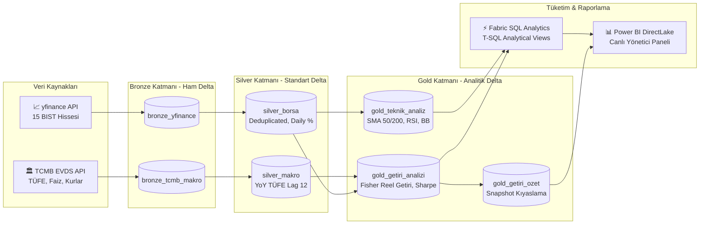

# 🏦 Kurumsal Bankacılık & Finansal Piyasa Veri Platformu (Microsoft Fabric & Power BI)

[](https://fabric.microsoft.com/)
[](https://delta.io/)
[](https://spark.apache.org/)
[](https://powerbi.microsoft.com/)
[](https://evds2.tcmb.gov.tr/)

---

## 📌 Proje Özeti

Bu proje, Borsa İstanbul hisse verileri ile TCMB makroekonomik göstergelerini tek bir analitik veri platformunda birleştiren, Microsoft Fabric üzerinde geliştirilmiş uçtan uca bir **Financial Data Engineering & Analytics** çözümüdür.

Platform; BIST’te işlem gören 15 şirketin piyasa verilerini yfinance üzerinden, döviz kuru, faiz ve enflasyon verilerini ise TCMB EVDS üzerinden otomatik olarak toplar. Veriler **Bronze → Silver → Gold Medallion Architecture** yaklaşımıyla PySpark ve Delta Lake kullanılarak işlenir; artımlı veri yükleme, veri kalite kontrolleri, deduplication ve tablo optimizasyonları pipeline içerisinde otomatik olarak gerçekleştirilir.

Gold katmanında SMA, RSI ve Bollinger Bantları gibi teknik göstergelerin yanı sıra reel getiri, volatilite, Sharpe oranı, faiz duyarlılığı ve piyasa likiditesi gibi finansal metrikler hesaplanır. Hazırlanan analitik veri setleri Fabric SQL Analytics Endpoint üzerinden T-SQL görünümleri ile sunulur ve Power BI DirectLake raporları aracılığıyla makro piyasa görünümü, şirket karşılaştırmaları ve detaylı performans analizleri için kullanılır.

Proje kapsamında özellikle hedef şirketler olarak belirlenen **Coca-Cola İçecek A.Ş. (CCOLA), Aksigorta A.Ş. (AKGRT), Gedik Yatırım Menkul Değerler A.Ş. (GEDIK), Mavi Giyim Sanayi ve Ticaret A.Ş. (MAVI)** ve **EİS Eczacıbaşı İlaç Sınai ve Finansal Yatırımlar Sanayi ve Ticaret A.Ş. (ECILC)** üzerine ayrıca odaklanılmıştır. Bu şirketler için genel piyasa karşılaştırmalarının yanı sıra kapanış fiyatı, reel getiri, volatilite, teknik trendler, işlem hacmi ve momentum göstergelerini içeren **şirket bazlı detaylı analiz raporları** oluşturulmuştur.

Projenin amacı yalnızca bir finans dashboard’u oluşturmak değil; **veri kaynağından karar destek katmanına kadar otomatik, ölçeklenebilir ve sürdürülebilir bir finansal veri pipeline’ı tasarlamaktır.**

---

## 🏗️ Uçtan Uca Platform Mimarisi

Sistem, tamamen bulut yerel (cloud-native) **Microsoft Fabric** üzerinde inşa edilmiştir:



---

## ⚙️ Microsoft Fabric Data Factory Orkestrasyonu

Platform, her işlem günü seans kapanışından sonra (TSİ **18:30**) otomatik olarak tetiklenir. Pipeline mimarisi; **Paralel Çatallanma (Fork-Join)**, **Hata Yönetimi (Circuit Breaker)**, **Otomatik Model Yenileme (DirectLake)** ve **Delta Bakımı (Z-ORDER)** adımlarını içerir:


### 🔄 İşlem Hattı Akış Adımları:
1. **Durum Başlatma (`Set variable1`):** Pipeline çalışma zaman damgası ve telemetrisi hafızaya alınır.
2. **Paralel Bronze Ingestion (Fork-Join):** 
   * `api_1a` (BIST 15 hissesi) ve `api_1b` (TCMB makro serileri) bağımsız ve eş zamanlı çekilir.
3. **Merkezi Silver Standardizasyonu (`bronztosilver`):**
   * Tip dönüşümleri, mükerrer kayıt temizliği (deduplication) ve türetilmiş metrikler hesaplanır.
4. **Hata Yakalama & Devre Kesici (Circuit Breaker):**
   * Silver adımında bir hata oluşursa akış durdurulur ve kırmızı okla bağlı `Office365Email2` mühendis ekibine anında hata bildirimi gönderir.
5. **Paralel Gold Analitiği:**
   * `gold_3a` (Teknik Analiz & Sinyaller) ve `gold_3b` (Fisher Reel Getiri & Sharpe) paralel hesaplanır.
6. **Doğrudan Model Yenileme (`Anlamsal modeli yenileme`):**
   * Power BI Semantic Modeli, insan müdahalesi olmadan DirectLake ile anında güncellenir.
7. **Otomatik Delta Lake Bakımı (`NB_04_Maintenance_Optimize`):**
   * Günlük artımlı yüklemelerin oluşturduğu küçük dosyalar `OPTIMIZE` ve `Z-ORDER` ile sıkıştırılır (Compaction).
8. **Başarı Bildirimi (`Office365Email1`):**
   * Tüm süreç başarıyla tamamlandığında yöneticiye onay e-postası iletilir.

---

## 📊 Power BI Yönetici & Analitik Raporlama Paketi (DirectLake)

Tüm raporlar OneLake üzerindeki Gold Delta tablolarına **DirectLake** moduyla bağlıdır. Veri modeli belleğe kopyalanmaz, sıfır gecikmeyle canlı çalışır. Paneller mantıksal bir yatırım bankacılığı akışıyla (Makro $\rightarrow$ Portföy $\rightarrow$ Şirket Röntgeni) 3 ana bölüme ayrılmıştır:

---

### Bölüm I: Makro Piyasa, Risk & Sektörel Görünüm (Top-Down Analiz)

#### 1. BIST Reel Getiri & Sektörel Piyasa Isı Haritası (Finviz / Bloomberg Stili)
Tüm 15 şirketin Fisher denklemi bazlı reel getiri karnesi, güncel teknik sinyalleri ve sağ altta sektör ağırlıklarına göre kümelenmiş devasa BIST Piyasa Isı Haritası (Treemap):


#### 2. Bankacılık Faiz Riski (IRRBB), Likidite & Makro Trendler
TCMB Politika Faizi ve döviz kurları (USD/TRY, EUR/TRY) yükselirken şirketlerin faiz duyarlılık betaları, likidite profilleri ve Risk vs. Getiri Dağılım Baloncuk Grafiği (Scatter Plot):


#### 3. 15 Hissenin Kümülatif Getiri Şampiyonları (2022 – 2026 Trendi)
Son 5 yıllık dönemde hisselerin kümülatif getiri ayrışması ve sağdaki dinamik şirket seçici (Slicer):


---

### Bölüm II: Danışmanlık Portföyü — Müşteri Şirketleri Kıyaslama Kokpiti

#### 4. Kilit 5 Müşteri Şirketi — 6'lı Karşılaştırmalı Performans Kokpiti
Firmanın çalıştığı 5 özel şirketin (*Coca-Cola İçecek, Mavi Giyim, Eczacıbaşı İlaç, Aksigorta, Gedik Yatırım*) likidite payı (Halka), enflasyona göre net kârı (Sütun), faiz üstü ekstra getirisi (Çubuk), piyasa trendi (Pasta), volatilite riski (Çubuk) ve RSI güç sıralaması (Huni):


---

### Bölüm III: Müşteri Şirketleri Derinlemesine Röntgen (Company Deep-Dives)

Her bir müşteri şirketi için özel olarak hazırlanmış; güncel kapanış fiyatı, Fisher reel getirisi, trend durumu, 50/200 günlük hareketli ortalamalar (SMA), fiyat & işlem hacmi trendi ve 14 günlük RSI osilatörünü içeren derinlemesine analiz sayfaları:

#### 5. Coca-Cola İçecek (`CCOLA.IS` | Hızlı Tüketim & İçecek)


#### 6. Mavi Giyim (`MAVI.IS` | Perakende & Tekstil)


#### 7. Eczacıbaşı İlaç (`ECILC.IS` | Sağlık & İlaç)


#### 8. Aksigorta (`AKGRT.IS` | Finans & Sigortacılık)


#### 9. Gedik Yatırım (`GEDIK.IS` | Finansal Hizmetler & Aracı Kurum)


---

## 🧮 Finansal Mühendislik & Metrik Hesaplamaları

Projede hem Power BI panellerinde hem de SQL sorgularında kullanılan temel finansal ve teknik göstergelerin hesaplama mantıkları ve finansal anlamları aşağıda özetlenmiştir:

### 1. Temel Getiri & Makro Finansal Metrikler

| Metrik | Formül / Hesaplama Mantığı | Finansal & İş Anlamı |
|---|---|---|
| **Fisher Reel Getiri** | `r_reel = ((1 + r_nominal) / (1 + i_TÜFE)) - 1` | Enflasyondan arındırılmış net satın alma gücü getirisi. Nominal getiri yüksek olsa bile paranın gerçekte ne kadar değer kazandığını ölçer. |
| **Trailing 1-Year Return** | `((Close_t - Close_t-252) / Close_t-252) * 100` | BIST takvimindeki son 252 aktif işlem gününü baz alan yıllıklandırılmış nominal hisse performansı. |
| **Yıllıklandırılmış Volatilite** | `σ_yıllık = σ_günlük * √252 * 100` | Günlük getirilerin standart sapmasının yıllık işlem günü kareköküyle (`√252`) çarpılmasıyla hesaplanan risk ve dalgalanma ölçüsü. |
| **Sharpe Rasyosu** | `(r_yıllık - Rf) / σ_yıllık` *(Rf: TCMB %40 Politika Faizi)* | Üstlenilen her 1 birimlik risk başına risksiz faizin üzerinde ne kadar ekstra getiri elde edildiğini ölçen portföy verimlilik katsayısı. |
| **Faiz Üstü Fazla Getiri (Alpha)** | `r_fazla = r_nominal - TCMB_Politika_Faizi` | Hissenin yıllık getirisinin risksiz para piyasası faizini (%40) ne kadar aştığını gösteren net prim marjı. |
| **TÜFE Yıllık Enflasyon** | `Lag(TÜFE_Endeks, 12)` bazlı gerçek YoY değişim | TCMB resmi TÜFE endeksinin tam 12 ay önceki değerine kıyasla yıllık artış oranı. |
| **Faiz Duyarlılık Betası (IRRBB)** | `β_faiz = Cov(Ri, ΔFaiz) / Var(ΔFaiz)` | TCMB faiz kararlarındaki değişimlerin şirketin piyasa değerine ve hisse fiyatına olan duyarlılık katsayısı. |

### 2. Teknik Analiz & Karar Destek Göstergeleri

| Gösterge | Formül / Hesaplama Mantığı | Finansal & İş Anlamı |
|---|---|---|
| **RSI (Göreceli Güç Endeksi, 14 Gün)** | `RSI = 100 - [100 / (1 + RS)]`<br>*(RS = Ort. Kazanç / Ort. Kayıp)* | 0–100 arasında salınan momentum hız göstergesi. Son 14 gündeki yükseliş gücünü ölçer.<br>• **`RSI < 35`:** **AŞIRI SATIM (Oversold)** $\rightarrow$ Fiyat gereğinden fazla düşmüş, toparlanma / alım fırsatı.<br>• **`RSI > 70`:** **AŞIRI ALIM (Overbought)** $\rightarrow$ Fiyat aşırı şişmiş, kâr satışı / düzeltme riski. |
| **Hareketli Ortalamalar (SMA 50 & 200)** | `SMA_n = (Close_1 + ... + Close_n) / n` | Hissenin son 50 işlem günü (kısa-orta vade) ve 200 işlem günü (uzun vade) kapanış fiyatlarının aritmetik ortalaması. Trendin yönünü belirler. |
| **Golden Cross (Altın Kesişim)** | `SMA_50 > SMA_200` *(Yukarı Kesişim)* | Kısa vadeli ortalamanın uzun vadeli ortalamanın üzerine çıkması. Piyasada güçlü bir **orta-uzun vadeli yükseliş (Boğa)** trendinin başladığı sinyalini verir. |
| **Death Cross (Ölüm Kesişimi)** | `SMA_50 < SMA_200` *(Aşağı Kesişim)* | Kısa vadeli ortalamanın uzun vadeli ortalamanın altına inmesi. Piyasada güçlü bir **düşüş (Ayı)** trendine girildiğini işaret eder. |
| **Bollinger Bantları (20 Gün, 2σ)** | • `Orta Bant = SMA_20`<br>• `Üst/Alt Bant = SMA_20 ± (2 * σ_20)` | Fiyatların istatistiksel normal dağılım sınırlarını belirler (%95 güven aralığı). Fiyat alt banda değerse dip/destek bölgesi, üst banda değerse tepe/direnç bölgesinde kabul edilir. |
| **Piyasa Likidite Rasyosu** | `Likidite = (Ortalama_Hacim_TL / Volatilite_%) * 10^-6` | Hissenin piyasa fiyatını dalgalandırmadan ne kadar hızlı ve kolay nakde dönebileceğini ölçen kurumsal ALM rasyosu. |

---

## 💻 Fabric SQL Analytics — 10 Temel İş Analitiği Sorgusu

Power BI raporlamasından bağımsız olarak, veri analistleri ve portföy yöneticilerinin Fabric **SQL Analytics Endpoint** üzerinde doğrudan çalıştırabileceği 10 temel iş sorgusu [`sql/sql_analysis.sql`](sql/sql_analysis.sql) dosyasında hazırlanmıştır:

1. **Enflasyonu Yenen Şampiyon Şirketler:** 15 şirket arasında enflasyonu en çok aşan ilk 5 şirket hangisi.
2. **5 Özel Müşteri Şirketimizin Güncel Durum Karnesi:** Danışmanlık müşterisi olan 5 şirketin son fiyat ve teknik sinyalleri nedir.
3. **Kelepir ve Potansiyel Alım Fırsatı Veren Hisseler:** RSI göstergesi 35 altında olan aşırı satılmış hisseler hangileri.
4. **Şirketlerin Risk Kademelerine Göre Dağılımı:** Hisselerden hangileri defansif sakin, hangileri agresif oynak.
5. **Sektör Bazında Ortalama Getiri ve Hacim Liderliği:** BIST'te hangi sektörler daha karlı ve piyasa likiditesinin ne kadarına sahip.
6. **TCMB Politika Faizi vs Enflasyon Makası:** Merkez Bankası faizi ile yıllık enflasyon arasındaki reel fark son aylarda ne oldu.
7. **Risksiz Faiz Üstü Ekstra Kazanç Sağlayanlar:** TCMB politika faizini geçip yatırımcısına ekstra prim kazandıran şirketler kimler.
8. **Piyasa Likidite Şampiyonları:** Günlük işlem hacmi en yüksek ilk 5 hisse senedi hangisi.
9. **Çift Hareketli Ortalamanın Üzerindeki Güçlü Boğa Hisseleri:** Hem 50 günlük hem 200 günlük ortalamasının üstündeki hisseler hangileri.
10. **Dolar Kuru Artışını Aşan Şirketler (Döviz Bazında Koruma):** 1 yılda Dolar kuru yaklaşık %35 arttı; dolardan daha çok kazandıran şirketler hangileri.

---

## 📁 Depo Dizin Yapısı (Repository Structure)

```text
├── config/
│   └── settings.py                 # 15 hisse senedi ve TCMB EVDS serileri yapılandırması
├── docs/
│   ├── architecture.md             # Detaylı sistem mimari dokümanı
│   ├── limitations_and_future_improvements.md # Mevcut kısıtlar ve geliştirme alanları
│   └── images/                     # Pipeline ve sıralı Power BI ekran görüntüleri
│       ├── fabric_data_factory_pipeline.png
│       ├── 01_makro_piyasa_ve_sektorel_isi_haritasi.png
│       ├── 02_bankacilik_risk_faiz_duyarliligi_ve_makro_trend.png
│       ├── 03_kumulatif_getiri_performans_trendi.png
│       ├── 04_musteri_sirketleri_karsilastirma_kokpiti.png
│       ├── 05_sirket_detay_coca_cola.png
│       ├── 06_sirket_detay_mavi_giyim.png
│       ├── 07_sirket_detay_eczacibasi_ilac.png
│       ├── 08_sirket_detay_aksigorta.png
│       └── 09_sirket_detay_gedik_yatirim.png
├── notebooks/                      # Microsoft Fabric PySpark kodları (Aktif 7 Notebook)
│   ├── 00_market_calendar_check.py # FinOps borsa tatil ve takvim denetimi
│   ├── 01a_ingest_yfinance.py      # BIST 15 hissesi artımlı veri çekimi (MERGE INTO)
│   ├── 01b_ingest_tcmb.py          # TCMB EVDS faiz, kur, enflasyon serileri çekimi
│   ├── 02_bronze_to_silver.py      # Tip dönüşümü, temizleme, deduplication ve unpivot
│   ├── 03a_gold_teknik_analiz.py   # SMA(50/200), RSI(14), Bollinger Bantları, Sinyaller
│   ├── 03b_gold_makro_getiri.py    # Fisher reel getirisi, Sharpe oranı, makro dashboard
│   └── 04_maintenance_optimize.py  # Delta Lake Z-ORDER Compaction ve bakım adımı
├── sql/
│   ├── analytical_views.sql        # Fabric SQL Endpoint analitik görünümleri (5 T-SQL View)
│   └── sql_analysis.sql            # 10 Temel iş analitiği ve karar destek sorgusu
├── .gitignore                      # Sistem, Python ve önbellek filtreleri
└── README.md                       # Proje dokümantasyonu
```

---

## 🚀 Kurulum ve Dağıtım Rehberi (Deployment Guide)

### 1. Ön Koşullar:
* Aktif bir **Microsoft Fabric** çalışma alanı (Workspace).
* TCMB EVDS API Anahtarı ([EVDS Kayıt](https://evds2.tcmb.gov.tr/)).

### 2. Adım Adım Kurulum:
1. **Lakehouse Oluşturma:** Fabric Workspace içerisinde `lh_bankacilik_finans` adında bir Lakehouse açın.
2. **Notebook'ları Yükleme:** `notebooks/` klasöründeki dosyaları Fabric içerisine Notebook olarak aktarın ve Lakehouse'unuza bağlayın.
3. **Data Factory Pipeline:** `pipeline_bist_makro_canli` adında bir pipeline açıp yukarıdaki mimari şemaya göre kutuları ve yeşil/kırmızı okları bağlayın.
4. **Zamanlayıcı (Schedule):** Pipeline'ı hafta içi her gün saat **18:30 (TSİ)** olarak zamanlayın.
5. **SQL Görünümleri:** Lakehouse'un **SQL analytics endpoint** penceresini açıp [`sql/analytical_views.sql`](sql/analytical_views.sql) dosyasını çalıştırın.
6. **Power BI DirectLake:** Fabric üzerinden doğrudan DirectLake modunda yeni rapor oluşturarak şablon görselleri bağlayın.

---

## 🛡️ FinOps & Kurumsal Veri Kalite Standartları

* **Artımlı Yükleme (Incremental MERGE INTO):** Geçmiş 5 yıllık veri her gün tekrar indirilmez; sadece yeni işlem gününün verisi `MERGE INTO` ile eklenir. Bu sayede pipeline süresi 15 dakikadan **1-2 dakikaya** iner.
* **FinOps Hafta Sonu Koruması:** Hafta sonları ve resmi tatillerde borsa kapalıyken sunucu kaynakları (Compute Units) çalıştırılmaz; bulut maliyeti optimize edilir.
* **Self-Healing Delta Bakımı:** `OPTIMIZE ... ZORDER BY (ticker, date)` komutuyla DirectLake sorgu hızları sürekli maksimumda tutulur.

---

## 🔍 Mevcut Kısıtlar ve Geliştirilebilecek Noktalar

Projenin mevcut sürümündeki mimari kısıtlar ve gelecek sürümler (V2) için yol haritası *(Detaylar için: [`docs/limitations_and_future_improvements.md`](docs/limitations_and_future_improvements.md))*:

1. **Merkezi Şirket Boyut Tablosunun (Star Schema) Eksikliği:** SQL View'lar ve Delta tabloları bağımsız olduğundan, Power BI rapor sayfalarında tekil filtreleme için görseller bazında filtre yönetimi gerekebilmektedir; merkezi bir `dim_sirket` ile Yıldız Şema kurgulanması hedeflenmektedir.
2. **Dinamik Tarih Boyutu ve İş Günü Takvimi:** Doğrudan ham `date` sütununa bağımlı olmak yerine BIST seans takvimi ve mali çeyrekleri içeren zengin bir `dim_tarih` tablosu entegrasyonu planlanmaktadır.
3. **Gün İçi Canlı Veri Akışının (Streaming) Bulunmaması:** Sistem seans sonu (Batch - Günlük 18:30) çalıştığından, Fabric Eventstream & KQL Database ile seans içi anlık veri akışı sağlanabilir.
4. **Satır Düzeyinde Güvenlik (Row-Level Security - RLS):** Danışmanlık ve analist ekiplerinin sadece kendi sorumlu oldukları müşteri şirketlerini görmesi için RLS yetkilendirmesi eklenecektir.

---

**Geliştirici:** Efe Hakan Yıldız  
**Platform:** Microsoft Fabric | Apache Spark | Delta Lake | Power BI DirectLake
